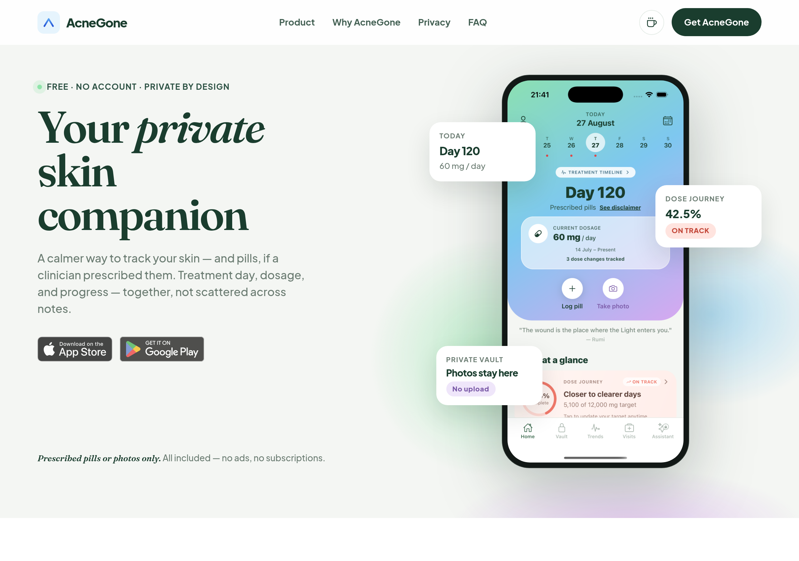
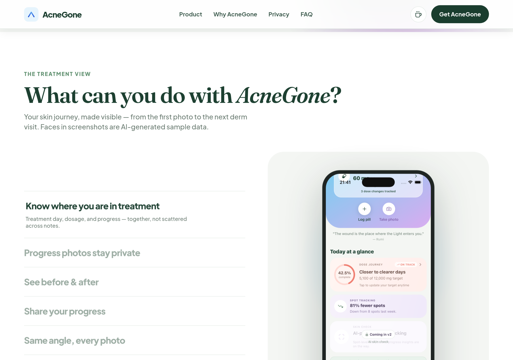
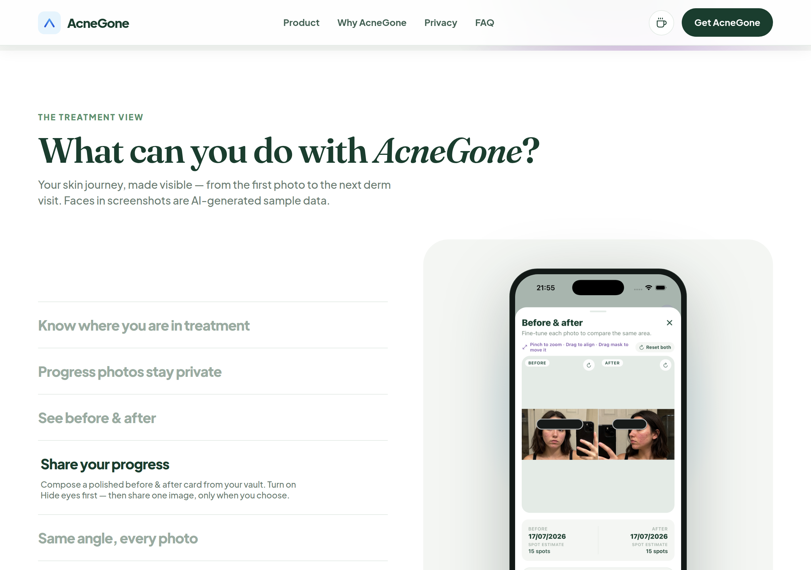
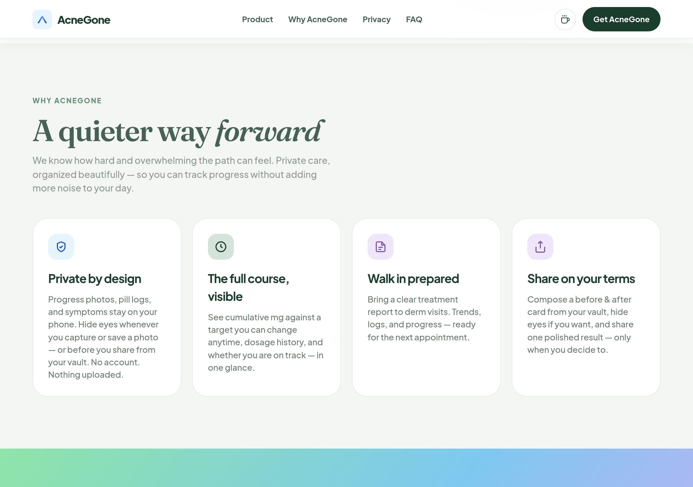
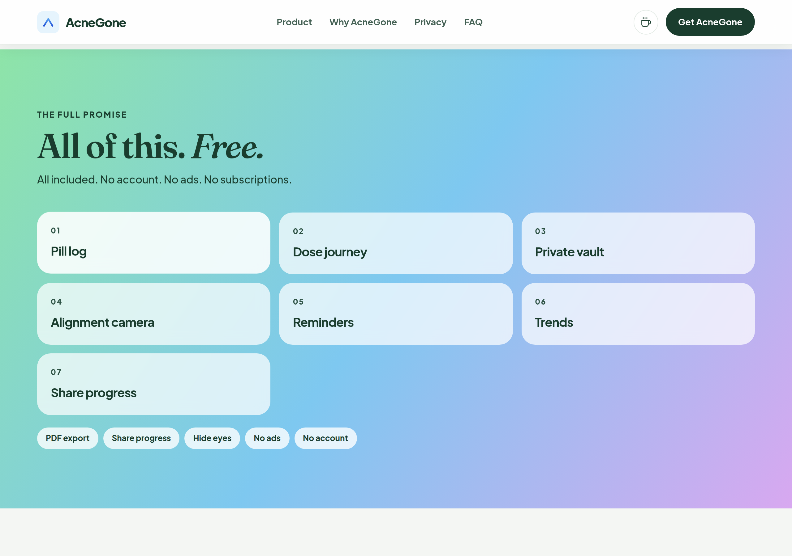
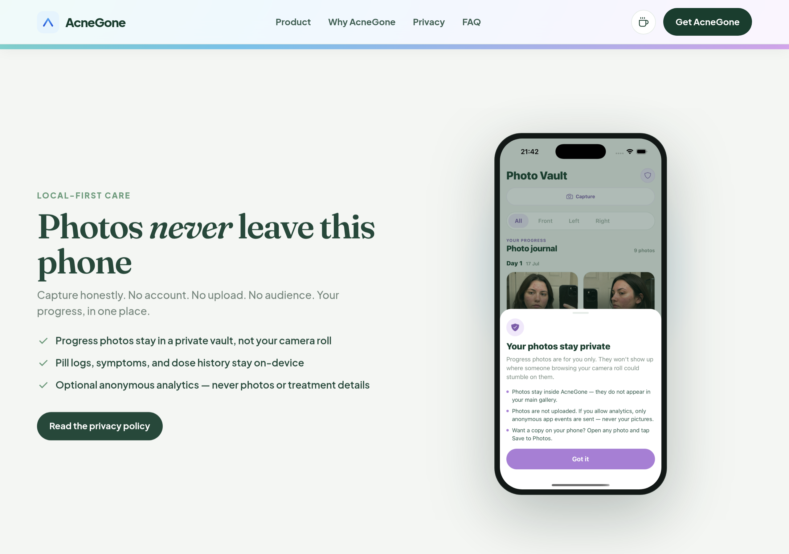

# AcneGone website

**[AcneGone](https://github.com/insomniac-engineer/AcneGone)** — a free, private skin tracker. Optional pill diary if your dermatologist prescribed tablets. No account, no ads, photos stay on your phone.
**Live site:** https://insomniac-engineer.github.io/AcneGone-website/

Faces in landing screenshots are AI-generated sample data, not a real person.

## What’s on the site

- **Hero** — product pitch, App Store / Google Play badges, animated phone mockup
- **Product** — interactive tabs pairing copy with in-app screenshots
- **Why AcneGone** — empathy-focused benefits for the full treatment course
- **Everything included** — free feature grid (no subscriptions)
- **Privacy** — on-device photos, optional analytics, link to privacy policy
- **Download** — closing CTA with drifting background orbs

### Highlights

- Dose journey, pill log, and treatment day tracking
- Private photo vault with compare, share (Hide eyes), and alignment camera
- Trends, symptoms, and PDF export for derm visits
- Medical disclaimer banner and full privacy policy page

## Site preview

### Product — dose journey

Interactive tabs let visitors explore each feature. Default tab shows the dose journey card and treatment progress.

### Product — share your progress

Share tab highlights the before/after card with **Hide eyes** enabled — a core privacy feature.

### Why AcneGone

Copy focused on the emotional weight of a long course — organized tracking without judgment.

### Everything included

All app features listed as free — pill log, vault, camera, trends, PDF export, and more.

### Privacy by design

On-device storage, no photo uploads, and optional anonymous analytics explained beside a phone mockup.

