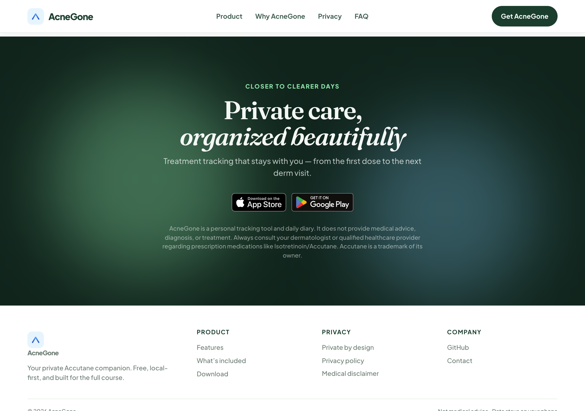

# AcneGone website

Marketing site for **[AcneGone](https://github.com/insomniac-engineer/AcneGone)** — a free, private companion for isotretinoin (Accutane) and skin tracking. No account, no ads, photos stay on your phone.

This repo is a static landing page (HTML/CSS/JS) published on GitHub Pages. The mobile app lives in the [AcneGone app repo](https://github.com/insomniac-engineer/AcneGone).

**Live site:** https://insomniac-engineer.github.io/AcneGone-website/

The preview images below live in [`screenshots/`](screenshots/) and are committed to the repo. For README copy or structure changes, reuse these files — no need to recapture.


## What’s on the site

- **Hero** — product pitch, App Store / Google Play badges, animated phone mockup
- **Product** — interactive tabs pairing copy with in-app screenshots
- **Why AcneGone** — empathy-focused benefits for the full treatment course
- **Everything included** — free feature grid (no subscriptions)
- **Privacy** — on-device photos, optional analytics, link to privacy policy
- **Download** — closing CTA with drifting background orbs

### Highlights

- Dose journey, pill log, and treatment day tracking
- Private photo vault with compare, share (Hide eyes), and alignment camera
- Trends, symptoms, and PDF export for derm visits
- Medical disclaimer banner and full privacy policy page

## Site preview

### Product — dose journey

Interactive tabs let visitors explore each feature. Default tab shows the dose journey card and treatment progress.


### Product — share your progress

Share tab highlights the before/after card with **Hide eyes** enabled — a core privacy feature.


### Why AcneGone

Copy focused on the emotional weight of a long course — organized tracking without judgment.


### Everything included

All app features listed as free — pill log, vault, camera, trends, PDF export, and more.


### Privacy by design

On-device storage, no photo uploads, and optional anonymous analytics explained beside a phone mockup.


### Download

Dark closing section with animated background orbs and official store badges.



## Local preview

```bash
python3 -m http.server 4173
```

Open http://localhost:4173

## Deploy

GitHub Pages serves the `main` branch from the repo root. Push to `main` to redeploy.

## App screenshots in `assets/screens/`

Phone mockups are exported from the [AcneGone](https://github.com/insomniac-engineer/AcneGone) app repo:

| Source | Screens |
|--------|---------|
| `AcneGone/store-listing/play/captures/` | Most in-app screenshots |
| `AcneGone/store-listing/play/compose-share-screenshot.cjs` | Share screen with Hide eyes |

```bash
# Regenerate share screenshot (from AcneGone repo)
cd ../AcneGone/store-listing/play
node compose-share-screenshot.cjs
```

Store badge SVGs live in `assets/badges/`.

## README screenshots (`screenshots/`)

These PNGs are **checked in** and referenced directly by this README. Edit the README or reuse the existing files as-is — you do not need to run the capture script for documentation updates.

| File | Section |
|------|---------|
| `01-hero.png` | Hero |
| `02-features.png` | Product — dose journey |
| `03-features-share.png` | Product — share / Hide eyes |
| `04-why.png` | Why AcneGone |
| `05-included.png` | Everything included |
| `06-privacy.png` | Privacy |
| `07-download.png` | Download |

### Optional: refresh captures

Only re-run the script when the live site layout or styling changes enough that the previews would look outdated:

```bash
npm install
npm run screenshots
# or against local preview: node scripts/capture-readme-screenshots.mjs http://localhost:4173/
```

Requires Google Chrome. Output overwrites the files in `screenshots/`.
